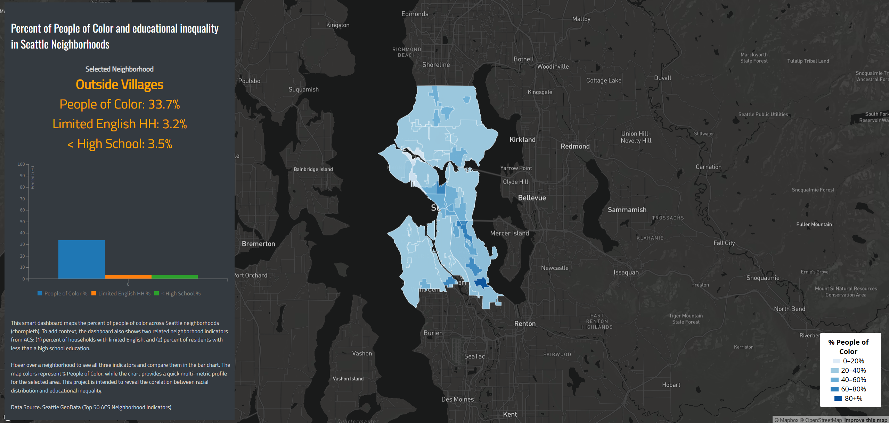

# Smart Dashboard: Percent of People of Color and Educational Inequality in Seattle Neighborhoods

## Overview

This smart dashboard visualizes spatial patterns of racial and educational inequality across Seattle neighborhoods using American Community Survey (ACS) data. The choropleth map shows the percent of people of color, while the interactive chart and information panel provide additional neighborhood indicators related to language access and educational attainment.

Users can hover over a neighborhood to dynamically view and compare multiple social indicators. This dashboard helps reveal spatial disparities and provides a multi-dimensional understanding of neighborhood characteristics.

---

## Live Map

View the dashboard here:

https://AllenVAL.github.io/geog458Dashboard/

---

## Screenshot

---

## Data Source

Seattle GeoData – Top 50 American Community Survey Neighborhood Indicators  
https://data-seattlecitygis.opendata.arcgis.com/

Variables used:

- Percent of People of Color (`PEOPLE_OF_COLOR_PERCENT`)
- Percent of Households with Limited English (`SPEAK_LIMITED_ENGLISH_HH_PERC`)
- Percent Less Than High School Education (`LESS_THAN_HIGH_SCHOOL_PERCENT`)

---

## Why Choropleth Map

A choropleth map is appropriate because the data represents percentages aggregated by geographic areas (neighborhood polygons). This map type allows users to easily compare spatial variation between neighborhoods and identify patterns of inequality.

Since the values are normalized percentages rather than raw counts, choropleth mapping provides an accurate and meaningful visual representation.

---

## Dashboard Components

This dashboard includes multiple interactive visualization components:

### 1. Choropleth Map
- Displays percent of people of color by neighborhood
- Uses a blue color gradient from low to high values
- Enables spatial comparison across Seattle

### 2. Interactive Chart (C3.js)
- Shows three indicators:
  - Percent of People of Color
  - Percent of Limited English Households
  - Percent Less Than High School Education
- Updates dynamically on hover

### 3. Information Panel
- Displays selected neighborhood name
- Shows precise values for all indicators
- Provides detailed contextual information

### 4. Legend
- Explains the color scale used in the choropleth map
- Helps interpret map values

---

## Interaction

Users can:

- Hover over neighborhoods to view detailed data
- Compare multiple social indicators using the chart
- Reset the map view using the reset button

---

## File Structure

